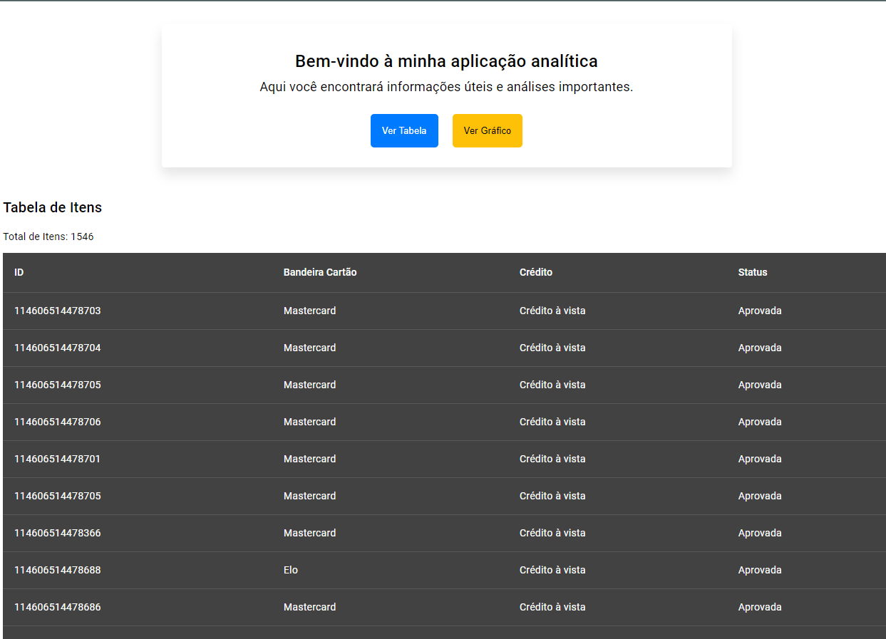
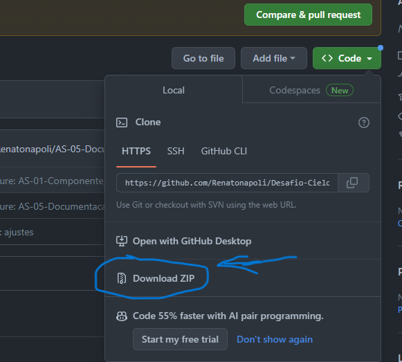

# DESAFIO CIELO


> Esta é uma aplicação desenvolvida para o bootcamp da Cielo, com intuito de comprovar conhecimentos em frontend e sendo uma das partes da avaliação do processo seletivo.

<div style="width:100%; display:flex; align-items:center; gap:16px">
    
</div>

## Detalhes do aplicativo

- O projeto consiste em uma aplicação analítica, na qual o usuário navegar entre as rotas clicando no botão Ver Tabela e Ver Gráfico.
Esses dados estão sendo consumidos da API que se encontra dentro da pasta Backend. Dados fornecidos em Json pela equipe da Cielo.

## 🚀 Melhorias futuras
- [ ] - Paginação

Infelizmente não consegui tempo para finalizar esta etapa, conciliando trabalho durante a aula e ao mesmo tempo desenvolvendo o projeto.

## Tecnologias utilizadas

- Scss (Ferramenta para produtividade na estilização)
- chart.js (Biblioteca para desenvolvimento de Gráficos)
- Angular versão 16.2.3

## API
- cors : 2.8.5
- express": 4.18.2


Usando a versão 18.17.1 do Node.js


## 💻 Como usar o projeto
Para utilizar e testar o projeto, esteja em um computador com Node Js instalado e siga as etapas abaixo:

1 clone o projeto com o comando
```
git clone https://github.com/Renatonapoli/Desafio-Cielo.git
```
Caso não consiga pelo git clone ou esteja dando algum problema interno no github, baixe o arquivo pelo zip. Após baixar o arquivo, descompacte e sigo os passos abaixo.

OBS: Verifique se possuia duas pastas dentro do projeto, Frontend e Backend. Feito pelo git clone quanto pelo download.zip.

<div style="width:100%; display:flex; align-items:center; gap:16px">
    
</div>


2 Abra dois terminais em sua IDE de preferência, aqui eu utlizo o VsCode. Em seguida abra dois terminais e acesse o projeto com o seguinte comando
```
No primeiro terminal - cd Frontend (Para ter acesso ao frontend)

No segundo terminal - cd Backend (Para ter acesso ao backend)
```

Se baixou o projeto pelo download.zip vai precisar acessar esse caminho, caso não tenha entrado direto pela sua IDE na segunda pasta com o mesmo nome que gerou ao fazer o download.

cd Desafio-Cielo-develop/Frontend

cd Desafio-Cielo-develop/Backend
```

3 Instale as dependências necessárias com o comando
```
npm install (Digite nos dois terminais, dentro da pasta Frontend e Backend)
```
4 No terminal Frontend digite o comando
```
npm start - Irá rodar tanto o frontend quanto o backend simultâneamente.
```
6 Acesse o projeto
```
http://localhost:4200/
```

## 🌐 Links úteis
[NodeJS](https://nodejs.org/en/download)
[ng2-charts](https://valor-software.com/ng2-charts/)
[Angular](https://angular.io/)


## 🧑‍💻 Renato Napoli Guimarães

[](https://www.linkedin.com/in/renato-napoli/)
